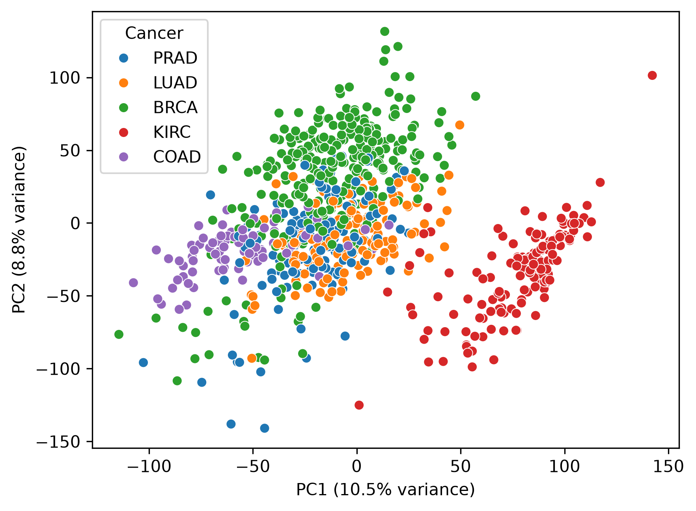
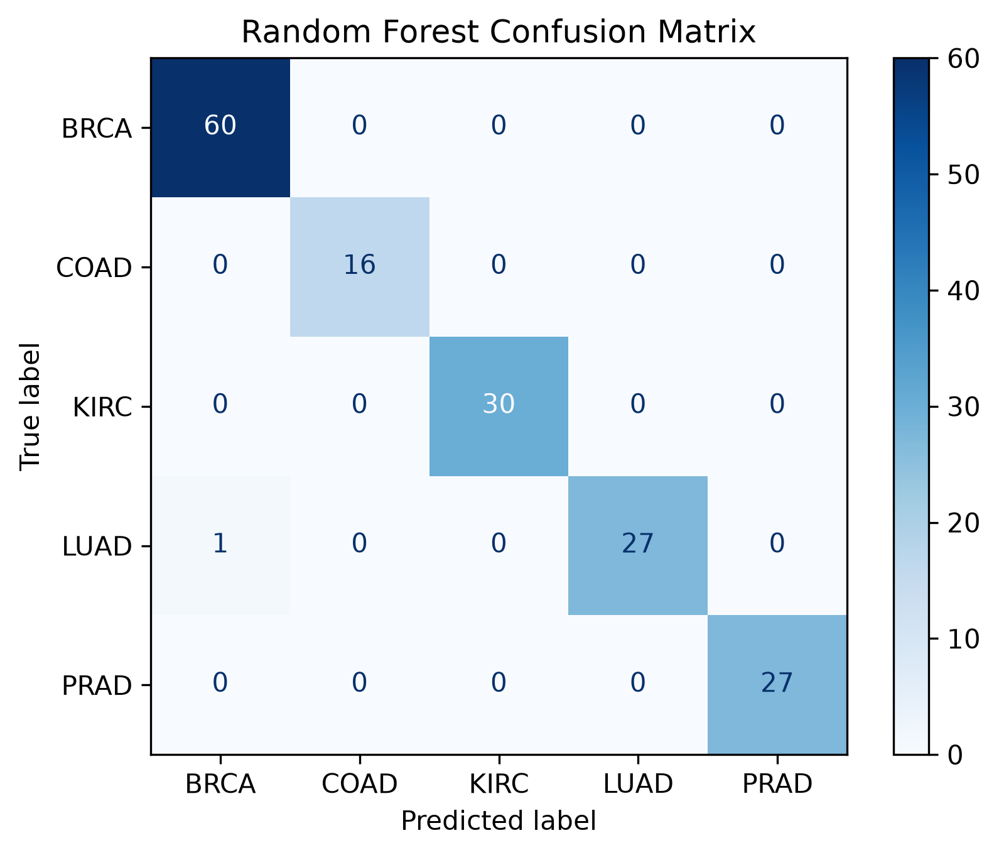
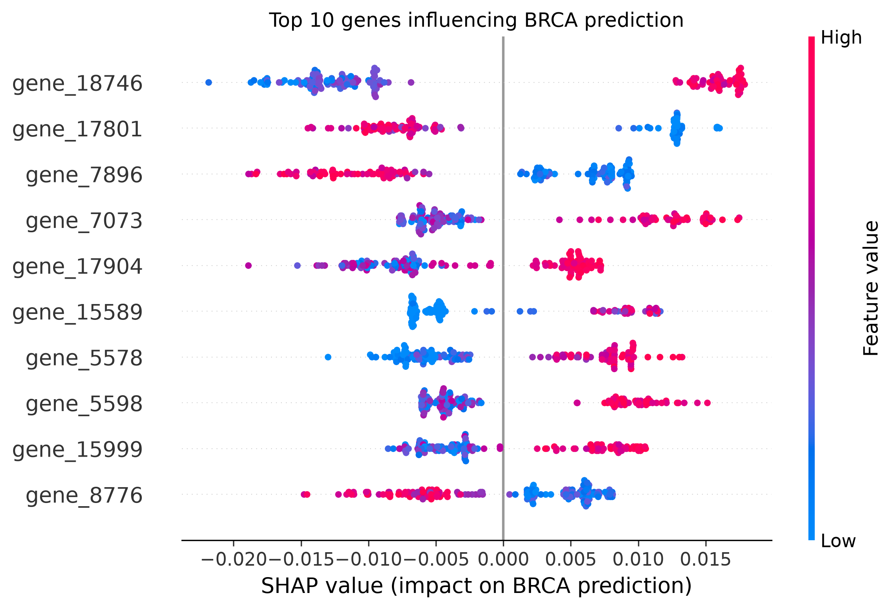

# Cancer RNA-seq Machine Learning
Pan-cancer classification using ML/tree-based methods on expression data

# Overview
Here we test several different classification methods to sepparate 5 different cancer types based on gene expression. We then do an initial probing using SHAP to identify genes important for each cancer type. 

# Dataset
https://archive.ics.uci.edu/dataset/401/gene+expression+cancer+rna+seq

We use the following dataset from the UC Irvine Machine Learning Repository. 
There are 801 cancer samples, 20531 genes, and 5 distinct cancer types.

## Methods
    • Logistic Regression
    • Random Forest
    • XGBoost

## Model Performance

| Model | Cross-validation Accuracy | Test Accuracy |
|:------|--------------------------:|--------------:|
| Logistic Regression | 0.998 | 0.988 |
| Random Forest | **0.997** | **0.994** |
| XGBoost | 0.991 | 0.981 |

Random Forest achieved the highest held-out test accuracy and was selected for downstream interpretation using SHAP.

## PCA of data

Initial PCA of the cancer types showed fairly clean separation based on expression. 
KIRC, COAD, and BRCA are more or less discrete clusters. LUAD and PRAD are more blended. 

## Confusion Matrix for Random Forest

Random forest was selected based on its performance. We see only one misclassification of LUAD as BRCA.

## SHAP beeswarm plot

Using SHapley Additive exPlanations (SHAP), we identify the most relevant genes for predicting BRCA across all patients. SHAP scores explain how much each feature in out models (in this case genes) push the model towards certain cancer classifications. This lets us identify genes with potential relevance for a given cancer state. Additionally the directionality of their their expression regarding the cancer can be inferred, i.e. if gene X is expressed higher that may be sign of BRCA. 

The beeswarm plot summarizes the influence of the 10 most informative genes for BRCA prediction across all patients. Each point represents one patient with color indicating the gene expression (red = higher expression). The highest ranked feature, gene_18746, predicted higher chance of BRCA cancer type with higher expression, while lower expression decreased BRCA prediction probability.

# Repository Structure

src/
    dataset.py
    model.py
    train.py
    evaluate.py
    optuna.py
    utils.py

notebooks/
    01_explore_data.ipynb - load/process data, initial overview
    02_train_model.ipynb - run different models and compare results
    03_final_evaluation.ipynb - SHAP analysis of best performing models

data/
    raw datasets
    processed datasets

figures/
    plots and model outputs

# How to run

### downloading data

curl -L -O "https://archive.ics.uci.edu/static/public/401/gene+expression+cancer+rna+seq.zip"
unzip gene+expression+cancer+rna+seq.zip
tar -xzf TCGA-PANCAN-HiSeq-801x20531.tar.gz